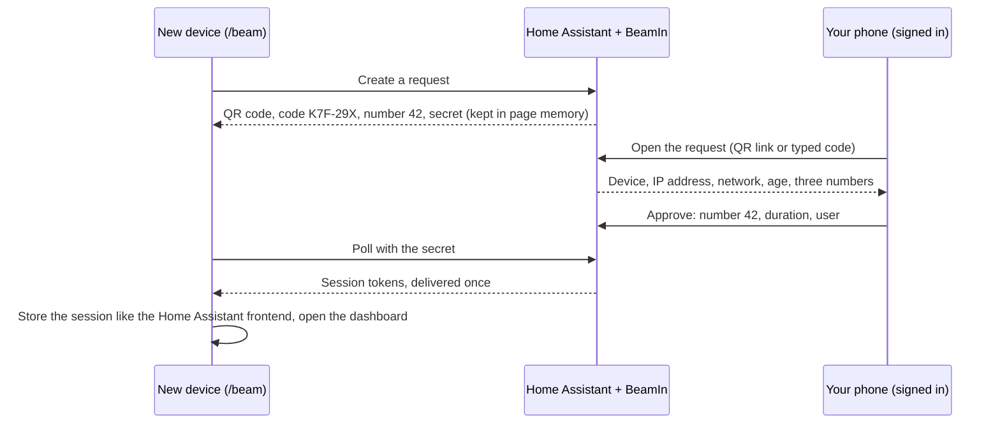

# BeamIn for Home Assistant — passwordless login with your phone (QR code / device code)

BeamIn brings **Home Assistant login without password** to every screen that is not signed in yet. Open `/beam` on the device, scan the **QR code login** screen with the phone you already use for Home Assistant, pick the matching number, tap **Approve**: the device lands on your dashboard. It is made for the **Tesla browser** and other car screens, a **wall tablet** or **kiosk**, a **TV**, a friend's computer — anywhere typing a long password is a pain. The same experience as "Sign in to Netflix on your TV", fully local, with no cloud service and nothing to configure.

> 🎬 **Demo (10 seconds):** the car browser shows a code → the phone scans it and approves → the car shows the dashboard.
> _Demo GIF coming soon._

[](https://my.home-assistant.io/redirect/hacs_repository/?owner=drslid&repository=beamin-home-assistant&category=integration)
[](https://my.home-assistant.io/redirect/config_flow_start/?domain=beamin)

## ✨ Scenarios

- 🚗 **In my car** — The car browser lost its session after an update? Open `your-home-assistant/beam`, scan, approve: the dashboard is on the car screen in seconds, without the on-screen keyboard.
- 📱 **Wall or living-room tablet** — Sign the tablet in as a dedicated, non-admin "Tablet" user: admins choose the account when they approve.
- 📺 **TV, Android TV, Fire TV** — No password to type with a remote: the TV shows a code, your phone does the rest.
- 💻 **A friend's or work PC** — Pick **Temporary (1 hour)**: the session is revoked automatically, even if Home Assistant restarts in between.
- 🆕 **New phone or computer** — Approve it from the device you already use.
- 👋 **Guest or babysitter** — Sign a limited account in for one hour.
- 🔁 **Expired session or cleared cache** — Kiosk browsers forget their session; `/beam` brings it back without the password.
- 🔑 **Very long password-manager password** — Keep your 40-character password in the manager and never type it on a TV again.

## 🚀 Install in 4 steps

1. In **HACS**, open the ⋮ menu → **Custom repositories**, add `https://github.com/drslid/beamin-home-assistant` with the type **Integration** (or use the HACS button above).
2. Search for **BeamIn** in HACS and select **Download**.
3. **Restart** Home Assistant.
4. Go to **Settings → Devices & services → Add integration → BeamIn** and confirm. No YAML, no option required.

Requires Home Assistant **2026.9.4** or newer.

## 📲 Usage

On the device to sign in, type **`your-home-assistant/beam`** (for example `https://ha.example.com/beam`) and **bookmark it**.

1. The device shows a QR code, a code such as `K7F-29X` and a big matching number.
2. On your phone, scan the QR code: it opens the **BeamIn** panel of Home Assistant. You can also open BeamIn from the sidebar and type the code.
3. Check the device, tap the number shown on its screen, choose **This device** or **Temporary (1 hour)**, then **Approve**.
4. The device lands on the dashboard, signed in as you.

A device that is still signed in goes straight from `/beam` to the dashboard.

### Which link does the QR code open?

The QR code contains `https://<your Home Assistant>/beamin?code=K7F29X`: the external URL of Home Assistant (or Home Assistant Cloud, then the internal URL), or the URL set in the options. Opening it only **shows** the request; nothing is approved until you pick the number and tap Approve.

The Companion app also understands deep links such as `homeassistant://navigate/beamin?code=K7F29X`, but BeamIn does not use them in the QR code:

- they only work if the app is installed; otherwise the camera shows a link that leads nowhere;
- the app documents a single query parameter (`server`), so passing the code is not guaranteed;
- with several servers configured, the app first asks which one to open;
- some Android camera and scanner apps do not offer to open custom URL schemes.

An `https://` link works with every camera app on iOS and Android, locally or remotely. If the phone's browser is not signed in to Home Assistant, open **BeamIn** in the Companion app and type the code instead: it is the same screen.

## ⚙️ Options

**Settings → Devices & services → BeamIn → Configure**

| Option | Default | Description |
| --- | --- | --- |
| Code lifetime | 120 s | How long a code stays valid (60–300 s). |
| Temporary session duration | 60 min | Lifetime of a "Temporary" session (5–1440 min). |
| URL in the QR code | Home Assistant's URL | Address your phone uses, such as `https://ha.example.com`. |
| Show BeamIn in the sidebar | On | When hidden, the panel stays reachable through the QR link or `/beamin`. |

## 🔐 How it works and why it is safe



- **The code alone grants nothing.** Tokens are only delivered to the page that created the request, which holds a 256-bit secret never shown, never in the QR code and never logged. The server keeps only its hash.
- **A person must approve.** Approving needs a signed-in Home Assistant session and an explicit POST: long-lived access tokens, system users and temporary BeamIn sessions cannot approve. There is no auto-approve mode and no push notification to tap by mistake.
- **Number matching.** The phone shows three numbers; only the one on the device screen works. A wrong pick cancels the request at once.
- **Short-lived and single-use.** A code expires after 120 seconds and is deleted after approval, denial or expiry.
- **Context before approval.** The approval screen shows the device and browser (as reported by the device, with Tesla, TV and tablet detection), its IP address, whether it is on your local network or on the internet, the age of the request and a reminder to approve only screens in front of you.
- **Brute force is pointless.** Codes come from 887 million combinations; at most 10 requests wait at once (3 per address, IPv6 counted per /64); creating and polling requests is rate limited; an approver is locked out for 5 minutes after 5 wrong codes; guessing a secret counts as a failed login in Home Assistant's own IP ban mechanism (it honours `ip_ban_enabled` and `login_attempts_threshold`).
- **Strict user rules, enforced by the server.** You sign the device in as yourself. Only administrators can pick another user, never a system or inactive user, and never the owner unless they are the owner. Local-only users can only be signed in on local devices. Approving an administrator on a car, TV or tablet shows a warning.
- **Real Home Assistant sessions.** Tokens come from Home Assistant's auth API with the same client ID as the frontend, so the device refreshes its session normally. Each session appears in **Profile → Security → Refresh tokens** as "BeamIn – Tesla browser" and can be revoked there.
- **Temporary really means temporary.** Temporary sessions are revoked on time; the schedule survives restarts, and sessions are revoked at once if BeamIn is disabled or removed.
- **A hardened page.** `/beam` loads nothing from the internet and runs offline. It sends a strict Content-Security-Policy without inline scripts, refuses framing, disables caching and referrers; tokens never appear in URLs.

The session is stored in the browser exactly where the Home Assistant frontend keeps it (`localStorage.hassTokens`). The format was checked against `src/common/auth/token_storage.ts` of home-assistant/frontend and `lib/auth.ts` of home-assistant-js-websocket in October 2026, and tested end to end with Home Assistant 2026.9.4 (frontend 20260826.7).

The full threat model is in [SECURITY.md](SECURITY.md).

## 🔔 Get notified when a device signs in

Import the blueprint **Notify when a device signs in with BeamIn**: it sends "Tesla browser signed in as Julien at 19:31" to your phone, and tapping the notification opens Profile → Security.

[](https://my.home-assistant.io/redirect/blueprint_import/?blueprint_url=https%3A%2F%2Fgithub.com%2Fdrslid%2Fbeamin-home-assistant%2Fblob%2Fmain%2Fblueprints%2Fautomation%2Fbeamin%2Fnotify_new_login.yaml)

BeamIn fires these events for your own automations:

| Event | When | Data |
| --- | --- | --- |
| `beamin_login_requested` | A device shows a new code | `device`, `device_type`, `ip` |
| `beamin_login_approved` | A device receives its session | `device`, `device_type`, `ip`, `user_id`, `user_name`, `target_user_id`, `target_user_name`, `duration` |
| `beamin_login_denied` | Denied, wrong number or refused delivery | `device`, `device_type`, `ip`, `user_id`, `reason` |
| `beamin_login_expired` | A code expired | `device`, `device_type`, `ip`, `approved` |

## ❓ FAQ

**Why not directly on the Home Assistant login page?**
The login page belongs to the core frontend and an integration cannot change it cleanly. BeamIn uses its own page, `/beam`, that you bookmark once. An opt-in "Sign in with my phone" button on the native login page is planned as an experimental feature.

**How do I revoke a device?**
Open **Profile → Security → Refresh tokens** with the account the device was signed in as, and delete the "BeamIn – …" entry. The device is signed out at once. Temporary sessions revoke themselves.

**Does it work remotely?**
Yes, through your external URL or Home Assistant Cloud: the device and the phone only need to reach Home Assistant. The approval screen tells you whether the device is on your local network or on the internet.

**Is the code enough to log in?**
No. The code only identifies the request. Someone must approve it from a signed-in session and pick the number shown on the device, and the session is only delivered to the page that created the request.

**Which account is the device signed in as?**
Yours. Administrators can choose another eligible user, for example a limited "Tablet" or "Guest" account.

**Why no notification when a device asks to sign in?**
Anyone who can reach `/beam` could otherwise flood your phone, and a tired tap is how MFA-fatigue attacks work. Use the blueprint to be told after a sign-in instead.

## ⚠️ Known limitations

- Home Assistant's native login page cannot be modified cleanly, hence `/beam`. A login-page button is planned as an experimental, disabled-by-default feature.
- The device description comes from its User-Agent: it is a hint the device chooses. Trust the IP address, the network and the screen in front of you.
- The session belongs to the address used to open `/beam`: open it with the same address you will use afterwards.
- In private or incognito windows the session ends when the window closes.
- The phone's browser must be signed in to open the QR link; otherwise, type the code in the BeamIn panel of the Companion app.
- Automations and long-lived access tokens cannot approve sign-ins, by design.

## 🛠️ Development

```bash
scripts/setup    # Python environment with the Home Assistant test harness
scripts/test     # pytest with coverage, then the frontend string checks
scripts/lint     # ruff, mypy, JavaScript syntax
scripts/develop  # a local Home Assistant on http://localhost:8123 with BeamIn linked in
```

## Trademark

Not affiliated with Home Assistant or the Open Home Foundation. Home Assistant is a trademark of the Open Home Foundation.

## License

[MIT](LICENSE)
